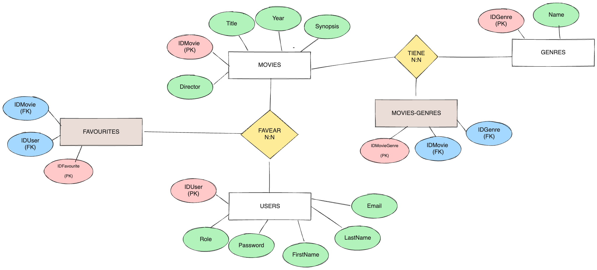

# PROJECT BREAK 3

Para el tercer proyecto del bootcamp los estudiantes podrán elegir entre dos opciones:

1. **PROYECTO FINAL FULL STACK DE IDEA LIBRE:** 
   
   Para elegir la primera opción: Proyecto final full stack de idea libre, es necesario validar la Primera Fase con el Profesor antes del 16 de Junio.

2. **PROYECTO ESPECÍFICO FRONT END**:
   
   Los estudiantes que no superen la evaluación de los módulos de BACK END y FRONT END, o que no completen satisfactoriamente la primera fase (diseño) descrita en la siguiente sección, deberán realizar un proyecto específico de FRONT END, así como otro ejercicio para recuperar el módulo no aprobado antes de que termine el bootcamp.

# PROYECTO FINAL FULL STACK DE IDEA LIBRE
## PRIMERA FASE: DISEÑO 
- **FECHA INICIO**: 3 JUN
- **FECHA LIMITE**: 16 JUN

1. **Título del Proyecto**: Título claro y descriptivo para el proyecto que refleje su propósito principal.
2. **Descripción**: Descripción detallada (máx. 1000 palabras) del proyecto, indicando las principales funcionalidades, roles de usuario y páginas.
3. **Wireframe Mid-Fi**: Un wireframe mid-fi representará con precisión la apariencia y funcionalidad de la interfaz de usuario. Aunque carece de estilos y elementos de diseño finales, proporciona una comprensión de la interfaz final del producto y de la interacción del usuario.
4. **Diseño de API**: Diseño detallado de la API, incluyendo paths, métodos HTTP, inputs y protección de rutas.
5. **Diseño de Base de Datos**: Estructura completa de la base de datos que soportará la aplicación, incluyendo modelo ER si optan por una base de datos relacional o esquemas de Mongoose si deciden utilizar MongoDB.

### EJEMPLO DE ENTREGA PARA`PRIMERA FASE`: 

#### 1. Título

TBFilms -  Plataforma de gestión de películas, que incluye la administración de géneros, usuarios y la funcionalidad de favoritos.
#### 2. Descripción

La aplicación permite a los usuarios ver un listado de películas, con título, año de publicación, director, sinopsis y etiquetas de género.

Habrá un buscador para encontrar películas por título en el listado. También se podrá filtrar por géneros.

Los usuarios autenticados pueden tener los siguientes roles:

- Usuarios: Guardar películas como favoritas.
- Administradores de contenido: Crear, editar y borrar datos de películas y géneros.

Los usuarios podrán ver un listado de películas favoritas.

#### 3. WIREFRAME MID-FI


#### 4. API DESIGN 

- POST /login {payload: (body)}
- POST /register {payload: (body)}

- GET /movies ==public==
- GET /movies/:movieId ==public==

- GET /movies/search ==public== {query parameters: search (string), genres (array of strings)}

- POST /movies ==admin== {payload: (body)}
- PUT /movies/:movieId ==admin== {payload: (body)}
- DELETE /movies/:movieId ==admin==

- GET /users/favorites ==user==
- PUT /users/favorites ==user== {payload: (body)}

- GET /genres ==public==
- POST /genres ==admin== {payload: (body)}
- PUT /genres/:genreId ==admin== {payload: (body)}
- DELETE /genres/:genreId ==admin==

#### 5. DISEÑO DE BASE DE DATOS

##### 5.1. OPCIÓN MYSQL: MODELO ENTIDAD-RELACIÓN



##### 5.2 OPCIÓN MONGODB: SCHEMAS DE MONGOOSE

```javascript
const movieSchema = new mongoose.Schema({
    title: { type: String, required: true },
    year: { type: Number, required: true },
    director: { type: String, required: true },
    synopsis: { type: String, required: true },
    genres: [{ type: mongoose.Schema.Types.ObjectId, ref: 'Genre', required: true }]
});

const userSchema = new mongoose.Schema({
    firstName: { type: String, required: true },
    lastName: { type: String, required: true },
    email: { type: String, required: true, unique: true },
    password: { type: String, required: true },
    isAdmin: { type: Boolean, default: false },
    favorites: [{ type: mongoose.Schema.Types.ObjectId, ref: 'Movie' }]
});

const genreSchema = new mongoose.Schema({
    name: { type: String, required: true, unique: true }
});
```

## SEGUNDA FASE: DESARROLLO
- **FECHA INICIO**: AL FINALIZAR MODULO DE FRONTEND

### REQUISITOS TÉCNICOS 

- Uso de **React** para la IU. Diseño **responsive adaptado a dos dispositivos**.
- Uso de **Express para api rest del backend**
- Usar una **librería de componentes** (mui, react bootstrap o chakra ui)
- Usar **Mongoose** para los modelos y comunicación con Mongodb o el driver de mysql si se decide optar por bases de datos relacional
- La api debe tener **mínimo 3 entidades de datos**. Uno de ellos users. La lógica de negocio debe tener sentido y representar la funcionalidad de una aplicación.
- **Validar entradas de usuario y a la base de datos. Dar feedback a los usuario** cuando no sea válido.
- Incluir funcionalidad de **registro**, login y logout. Sistema de **usuarios con las **contraseñas almacenadas encriptadas y basado en tokens de jwt**.
- **Dos niveles de privilegio de usuario. Resolver autorización**. Los usuarios registrados podrán hacer cosas adicionales a los que no están registrados e incluir otro nivel de privilegios de usuario superior al registrado que pueda hacer alguna cosa más adicional.
- Resolver un **CRUD completo de al menos uno de los modelos**
- Tener **dos repositorios en Github (react y express)**
- Mantener repositorio o repositorios para el proyecto completo. **Registrar commits siguiendo buenas prácticas** cada día con el avance. ==REQUISITO IMPRESCINDIBLE==
- **Desplegar el servicio** para que pueda usarse.
